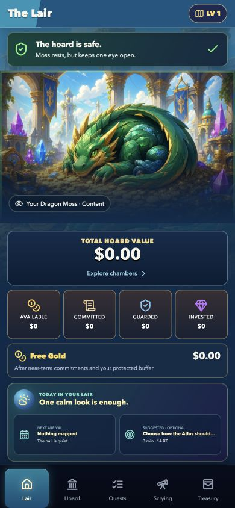
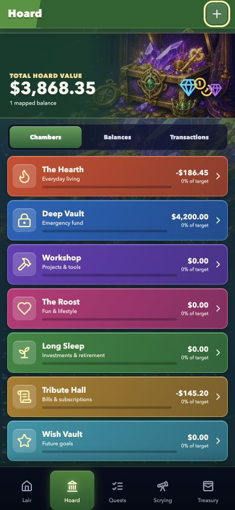
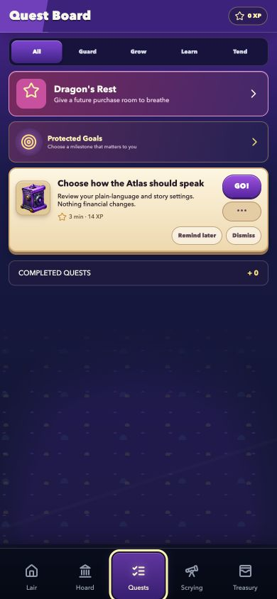
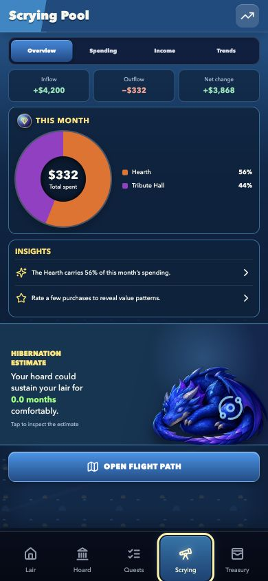

# Dragon Mode - Turn Your Money into an Adventure

## Inspiration

Money apps often make people feel as if they are being judged. They focus on warnings, restrictions, and everything that has gone wrong. At the same time, games are remarkably good at making slow progress feel exciting.

Dragon Mode grew from a simple question: what if looking after your money felt like protecting a dragon's hoard?

We wanted to create something warm, colourful, and encouraging—an app that helps people face their finances without shame. Progress should come from showing up, learning, and making thoughtful choices, not from already being wealthy or maintaining a perfect streak.

## What it does

Dragon Mode turns everyday money management into a fantasy adventure.

Users can record income and spending, bring in transactions from a bank statement, organise money into themed chambers, set goals, track regular bills, understand debt, and explore simple forecasts. The Scrying Pool turns the numbers into clear charts and observations, while the Quest Board suggests small, practical actions.

As users build healthier habits, they also grow a fantasy world filled with dragons, pets, story chapters, and collectible treasures. These rewards are earned by engaging with the app; they cannot be purchased and never affect a user's finances.

Dragon Mode does not need a bank connection or a user account. Financial details stay on the user's device, and the app cannot move money or make financial decisions on anyone's behalf.

## How we built it

We began with a set of fantasy game screen concepts, then turned them into one complete mobile experience. The app is organised around five consistent destinations: Lair, Hoard, Quests, Scrying, and Treasury.

The interface was built with React and TypeScript. IndexedDB stores the user's information on their device, while Capacitor packages the experience for iPhone and Android and supports features such as reminders and haptic feedback.

We built the financial side and the game side as one system. Transactions update balances and charts, completed actions can award progress, and confirmed events can open new story moments. Bank-file imports are previewed before anything changes, uncertain matches remain visible for review, and an imported batch can be undone exactly.

We also created automated checks for calculations, imports, backup and restore, accessibility labels, phone layouts, and native iPhone builds.

## Challenges we ran into

The biggest challenge was balancing fantasy with trust. Money can be stressful, so the game layer had to make the experience gentler without hiding important information or making light of difficult situations.

Importing transactions was another major challenge. Two purchases can have the same shop, date, and amount without being duplicates. Pending charges can later become completed charges, refunds can resemble income, and transfers between a user's own accounts should not look like spending. We chose to keep uncertain cases visible and let the user decide instead of silently deleting anything.

The original screen concepts also used conflicting navigation and very small canvases. We had to preserve their personality while creating one system that works on real phone sizes, supports scrolling, and remains readable with larger text.

Finally, we needed the app to begin genuinely empty while still feeling welcoming. The guided setup therefore runs over the real app, can be skipped or replayed, and never inserts pretend financial records.

## Accomplishments that we're proud of

We are proud that Dragon Mode became a working product rather than a collection of attractive mock-ups.

It includes a complete transaction ledger, statement importing, goals, recurring costs, debt and investment tracking, projections, thirteen plain-language planning tools, ten permanent story chapters, pets, quests, and an earned-only collection system.

We are especially proud of the trust-focused details: exact import undo, visible assumptions, non-punitive progress, private reminder text, complete backup and restore, and a first launch containing no invented money.

The release checks now cover the web and mobile builds, calculations, import edge cases, backups, migrations, accessibility basics, and a fresh iPhone Simulator installation. The app has also been checked at both modern and compact phone sizes without horizontal overflow.

## What we learned

We learned that rewarding care is very different from rewarding wealth. A person should be able to make meaningful progress by checking in, learning, and completing a small task—regardless of how much money they have.

We also learned that clear explanations matter as much as correct calculations. Every planning tool shows where its numbers came from, what assumptions were made, and what was left out.

Building the import system reinforced another lesson: when software is uncertain about financial data, it should ask rather than guess.

Finally, we learned that strong visual design can change the emotional tone of a difficult task. A familiar dragon, a calm quest, and a colourful world can make opening a finance app feel far less intimidating.

## What's next for Dragon Mode - Turn Your Money into an Adventure

The next step is final testing on a physical iPhone, followed by a signed TestFlight build and App Store submission. Android and tablet testing will follow the iPhone release.

After launch, we want to learn from real users before expanding the feature set. Possible additions include more languages, photos for personal wishes, more flexible projection dates, and deeper accessibility testing.

A future bank connection is also possible, but only after the privacy, security, consent, and legal questions are properly addressed. Dragon Mode's calm, user-controlled approach will remain the priority.

## Built with

- React
- TypeScript
- Next.js
- Vite and Vinext
- Capacitor for iOS and Android
- IndexedDB
- Lucide icons
- Cloudflare Workers
- Node.js test runner
- ESLint
- GitHub Actions
- Xcode and the iOS Simulator

## Try it out

- [Try Dragon Mode in your browser](https://alexzander73.github.io/DragonMode/)
- [Source code and local run instructions](https://github.com/AlexZander73/DragonMode#local-development)
- iPhone TestFlight: preparing for release

## Screenshots

### The Lair

### Your Hoard

### Quest Board

### Scrying Pool

